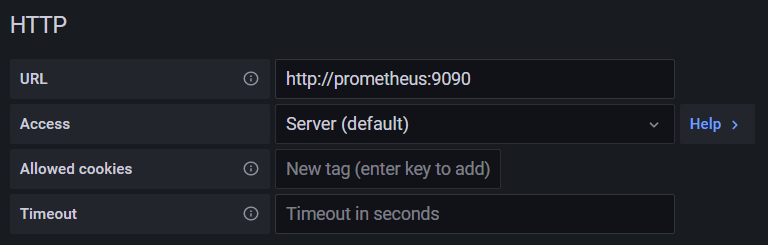
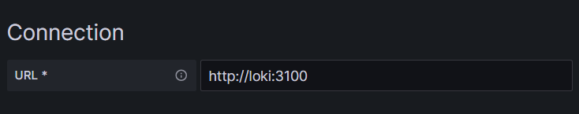

# docker-monitor
Monitor docker server using node_exporter, cadvisor, prometheus, promtail, loki and display on grafana.

1. Compose up.
```
docker compose up -d
```
2. Connect to grafana. Default user and password is [admin](https://grafana.com/docs/grafana/latest/administration/configuration/#admin_user)
```
http://docker-host:3000
```
3. Add prometheus as datasource.
```
http://prometheus:9090
```


4. Add loki as datasource.
```
http://loki:3100
```


5. Add dashboard to grafana.
  - Host monitor
    - [Node Exporter Full](https://grafana.com/grafana/dashboards/1860)
    - [1 Node Exporter for Prometheus Dashboard EN 20201010](https://grafana.com/grafana/dashboards/11074)
  - Containrt monitor
    - [Docker Container](https://grafana.com/grafana/dashboards/11600)
    - [Docker monitoring with node selection](https://grafana.com/grafana/dashboards/8321)
  - Log monitor
    - [Container Log Dashboard](https://grafana.com/grafana/dashboards/16966-container-log-dashboard)
